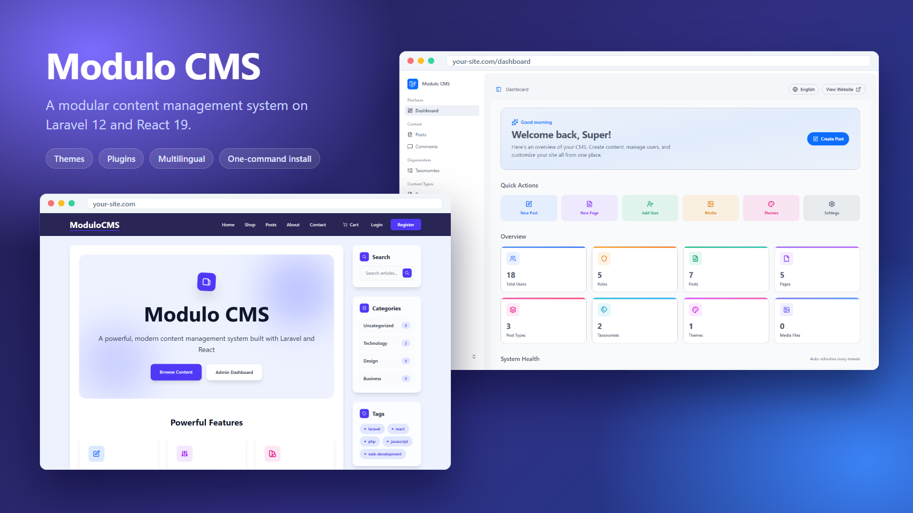
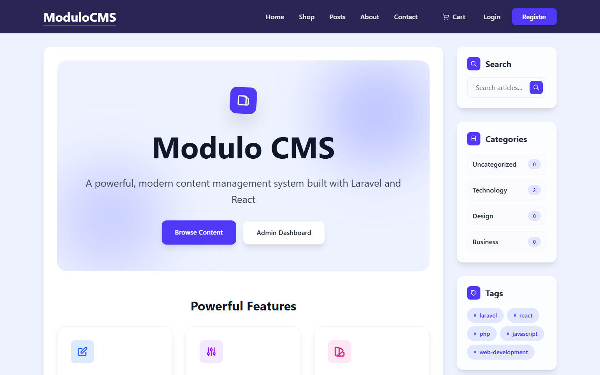
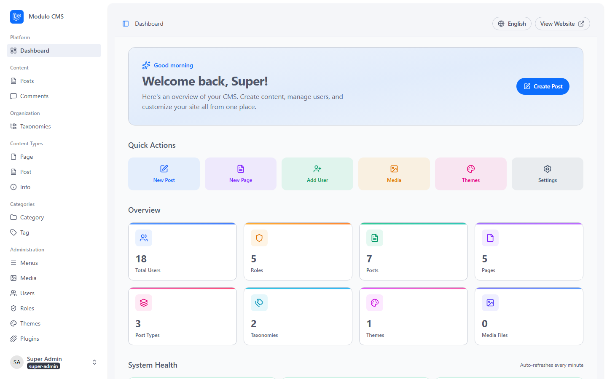
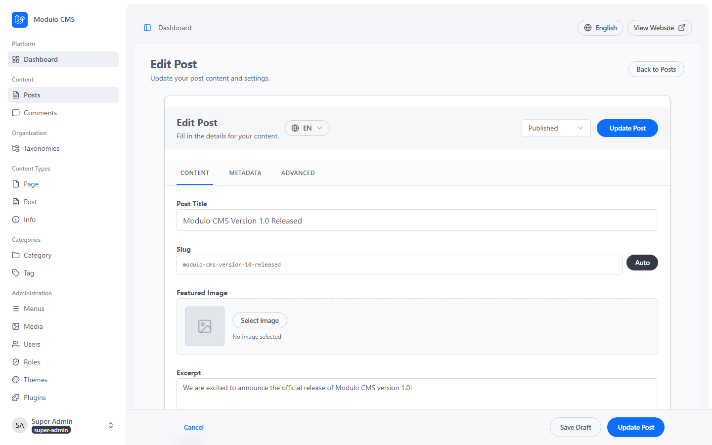
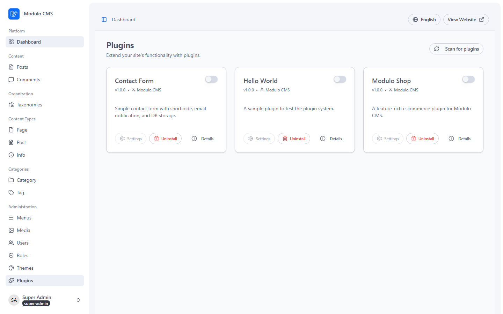
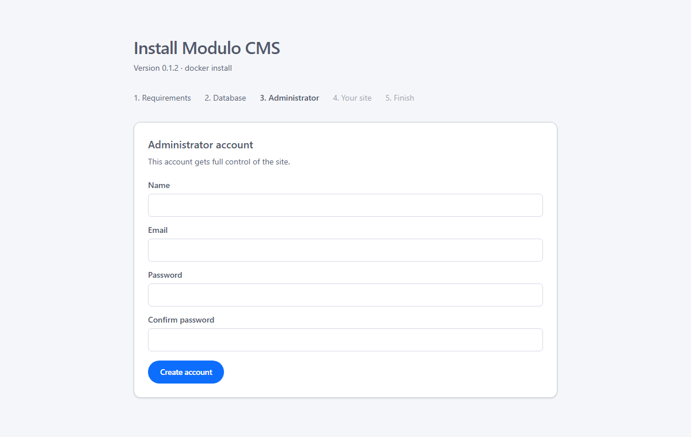

# Modulo CMS

[](https://github.com/PhantomPixelDev/modulo-cms/actions/workflows/tests.yml)
[](https://github.com/PhantomPixelDev/modulo-cms/actions/workflows/lint.yml)
[](LICENSE)
[](https://www.php.net/)
[](https://laravel.com/)



A self-hosted, modular content management system built on Laravel 12 with a React 19
front end. Custom post types, taxonomies and menus; a media library; multi-language
content; role-based permissions; and a plugin and theme system.

> **Status:** it runs, it is tested, and it has an installer, tagged releases and a
> supported upgrade path. The plugin API is new and may still change; pin `MODULO_TAG`
> to an exact version rather than following `latest` if that matters to you.

## What you get

- **Content** — custom post types and taxonomies, hierarchical pages, drafts and
  scheduling, a media library with conversions, and full-text search (PostgreSQL
  `tsvector` with ranking).
- **Multi-language** — per-locale translations for posts, terms, menus and settings.
- **Access control** — roles and granular permissions, with guards against privilege
  escalation. A non-super-admin cannot edit the `super-admin` role or grant themselves
  permissions they do not hold.
- **Themes** — React components resolved per theme, with a default `modern-react` theme.
- **Plugins** — a service-provider based plugin system with WordPress-style
  `add_action` / `add_filter` hooks. Ships with a contact form and a small shop, and
  installs more from the checksum-verified
  [plugin registry](https://github.com/PhantomPixelDev/modulo-registry).
- **Operations** — a real `/health` readiness probe, nightly database backups, a queue
  worker and scheduler, and a hardened nginx configuration.

## Screenshots

<table>
  <tr>
    <td width="50%"><br><sub>Public site, default <code>modern-react</code> theme</sub></td>
    <td width="50%"><br><sub>Admin dashboard</sub></td>
  </tr>
  <tr>
    <td width="50%"><br><sub>Post editor, per-locale content</sub></td>
    <td width="50%"><br><sub>Plugins</sub></td>
  </tr>
  <tr>
    <td width="50%"><br><sub>First-run install wizard</sub></td>
    <td width="50%"></td>
  </tr>
</table>

## Requirements

Docker or Podman with a Compose provider. Nothing else — no local PHP, Node or
PostgreSQL. `modulo.sh` is a bash script, so on Windows use Git Bash or WSL.

## Quick start (development)

```bash
git clone https://github.com/PhantomPixelDev/modulo-cms.git
cd modulo-cms
cp .env.dev.example .env.dev
./modulo.sh up dev
```

First boot takes a few minutes: it builds images, installs dependencies, generates an
`APP_KEY`, migrates, seeds demo content and installs the default theme.

| | |
|---|---|
| Site | <http://localhost:8000> |
| Dashboard | <http://localhost:8000/dashboard> |
| Mailpit (captured email) | <http://localhost:8025> |

Seeded logins — **development fixtures, never use them in production**:

| Email | Password | Role |
|---|---|---|
| `admin@example.com` | `admin123` | super-admin |
| `editor@example.com` | `editor123` | editor |
| `user@example.com` | `user123` | user |

If the dev stack feels slow on Windows, that is the bind mount — see
[docs/performance-windows.md](docs/performance-windows.md).

## Production

The quickest path, if you have Docker or Podman:

```bash
curl -fsSLO https://raw.githubusercontent.com/PhantomPixelDev/modulo-cms/main/install.sh
less install.sh          # read it before running it
bash install.sh
```

On Windows, download `install.ps1` instead and run `.\install.ps1`.

It checks prerequisites, generates a unique `APP_KEY` and database password,
starts the stack and prints a URL to finish setup in your browser. It only
writes inside the directory it creates.

To set things up by hand instead:

```bash
cp .env.prod.example .env.prod
# Required: APP_KEY, DB_PASSWORD, APP_URL. Generate a key with:
#   docker run --rm php:8.4-cli php -r "echo 'base64:'.base64_encode(random_bytes(32)).PHP_EOL;"
./modulo.sh up prod
```

The production site is served on `WEB_PORT`, **which defaults to 8080** — not 8000 like
the dev stack.

The production stack runs published images from GHCR. `MODULO_TAG` in `.env.prod`
selects the release — `latest` follows the newest non-prerelease; pin an exact version
such as `0.1.2` for a predictable deploy. See
[releases](https://github.com/PhantomPixelDev/modulo-cms/releases).

To run your own changes instead of a published image, build locally:

```bash
MODULO_BUILD=1 ./modulo.sh up prod
```

That layers `docker/docker-compose.build.yml` over the stack and builds from this
checkout. Locally built images are not stamped with a version unless you pass
`MODULO_VERSION`.

### First run

Visit `/install` and the wizard walks through requirements, database setup, the
administrator account and your site name. It closes itself afterwards and returns 404.

For a headless deployment, do the same from the command line:

```bash
MODULO_ENV=prod ./modulo.sh artisan modulo:install
```

Both paths run the same code. Neither seeds demo content unless you ask for it —
sample data creates accounts whose passwords are published in this README, so it is
off by default and `modulo:seed-demo` refuses to run in production without `--force`.

`docker/docker-compose.yml` starts:

| Service | Purpose |
|---|---|
| `web` | nginx on `WEB_PORT` (default 8080); serves `public/`, only `/index.php` runs PHP |
| `app` | PHP-FPM with opcache; runs `modulo:upgrade` on boot when `RUN_MIGRATIONS=true`, caches config and views |
| `queue` | `queue:work` for queued mail and jobs |
| `scheduler` | `schedule:work` |
| `db` / `redis` | PostgreSQL 16 and Redis 7 |

The stack speaks plain HTTP by design: put a TLS-terminating proxy (Caddy, Traefik, a
load balancer) in front of `web` and set `APP_URL` to the `https://` address.

Post type, taxonomy and locale URLs are resolved at request time, so adding content
types never requires rebuilding the route cache.

See [SECURITY.md](SECURITY.md) for the full hardening checklist.

## The helper script

`modulo.sh` wraps Compose for both stacks. It uses Docker if it is on `PATH` and
otherwise Podman; set `MODULO_RUNTIME` to force one.

```bash
./modulo.sh up dev              # start (dev is the default environment)
./modulo.sh logs                # follow logs
./modulo.sh shell               # shell in the app container
./modulo.sh migrate             # run migrations
./modulo.sh test                # run the test suite
./modulo.sh status              # container status
./modulo.sh bootstrap-dev       # rebuild dev from scratch (destroys dev data)
./modulo.sh up prod             # the same commands take a prod argument
```

For Artisan, the environment comes from `MODULO_ENV` — everything after `artisan` is
passed through untouched:

```bash
./modulo.sh artisan migrate:status
./modulo.sh artisan modulo:db-backup --keep=30
MODULO_ENV=prod ./modulo.sh artisan queue:failed
```

### Dev startup toggles

`docker-dev/docker-compose.yml` sets these on the `app` service:

| Variable | Default | Effect |
|---|---|---|
| `FORCE_COMPOSER_INSTALL` | `false` | Reinstall Composer dependencies on every boot |
| `RUN_MIGRATIONS` | `false` | Migrate on every boot |
| `RUN_SEEDERS` | `false` | Seed on every boot |
| `ENSURE_DEFAULT_THEME` | `true` | Install and activate the default theme if none is active |
| `DEFAULT_THEME_SLUG` | `modern-react` | Which theme that is |

Note that `RUN_MIGRATIONS` and `RUN_SEEDERS` control behaviour on **subsequent** boots.
A fresh database (no `migrations` table) always migrates and seeds regardless, so the
first boot gives you a working site.

## Upgrading

```bash
MODULO_ENV=prod ./modulo.sh artisan modulo:upgrade --dry-run   # see what would happen
MODULO_ENV=prod ./modulo.sh artisan modulo:upgrade
```

It backs up, takes the site down, migrates, applies bootstrap data and lifts
maintenance mode — and refuses to start if a preflight check finds data that would
break a migration partway through. **System → Updates** in the admin shows whether a
newer release exists (and whether it is a security release), plugin updates with
one-click install, and the exact commands for your install channel. A daily check
emails administrators when something new is available. **System → Backups** takes
full backups (database, media, plugins); see [docs/backup-restore.md](docs/backup-restore.md).

See [docs/upgrading.md](docs/upgrading.md).

All documentation is in [docs/](docs/) (start with [docs/architecture.md](docs/architecture.md)); `npm run docs:dev` serves it as a searchable site.

## Operations

```bash
./modulo.sh version                       # running version and install channel
./modulo.sh backup                        # dump the database
./modulo.sh restore prod backup.sql       # destructive; stops writers first
MODULO_ENV=prod ./modulo.sh update        # pull images, then migrate safely
```


**Health** — `GET /health` returns `{"status":"ok"}`, or 503 when the database or cache
is unreachable. Both the `web` and `app` containers use it as their healthcheck.

**Backups** — the scheduler dumps nightly at 03:15 into `storage/app/backups`, keeping
the last 7.

```bash
MODULO_ENV=prod ./modulo.sh artisan modulo:db-backup
MODULO_ENV=prod ./modulo.sh artisan modulo:db-backup --keep=30
```

Restore a PostgreSQL dump, stopping the writers first:

```bash
docker compose -f docker/docker-compose.yml stop app queue scheduler
docker compose -f docker/docker-compose.yml exec -T db psql -U modulo -d modulo_prod < backup.sql
docker compose -f docker/docker-compose.yml start app queue scheduler
```

**Failed jobs** — queued mail that keeps failing lands in `failed_jobs`:

```bash
MODULO_ENV=prod ./modulo.sh artisan queue:failed
MODULO_ENV=prod ./modulo.sh artisan queue:retry all
```

## Plugins

```bash
php artisan plugin:list --available
php artisan plugin:install contact-form --activate
php artisan plugin:update --all
```

Packages are downloaded from allowlisted hosts and verified against the checksum in
the registry before anything is unpacked, then extracted defensively — traversal
entries, symlinks, oversized archives and unexpected file types are all refused
before a byte is written. A failed update restores the previous version.

Note that a plugin runs as part of the application and is not sandboxed. See
[docs/plugins.md](docs/plugins.md).

## Bundled plugins

**Contact Form** — a `[contact_form]` shortcode that stores submissions and emails the
configured admin address. Activate it in the admin plugin manager, then set a recipient
in **Site Settings → General → Admin Email** or via `MAIL_ADMIN_ADDRESS`.

```
[contact_form]
[contact_form subject="Support request"]
```

**Shop** — products (as a post type), cart, checkout, stock handling and order emails,
with an admin section for orders.

## Tests

```bash
./modulo.sh test                        # Pest, SQLite in-memory
npm run test:js                         # Vitest, front end
vendor/bin/pest -c phpunit.pgsql.xml    # Pest against PostgreSQL
```

The PostgreSQL run needs a reachable server and a `modulo_test` database; CI runs it on
every push, because production is PostgreSQL and some bugs only reproduce there.

## Documentation

| | |
|---|---|
| [Installation](docs/installation.md) | Docker, tarball or git, and first-run setup |
| [Configuration](docs/configuration.md) | Every environment variable that matters |
| [Upgrading](docs/upgrading.md) | `modulo:upgrade`, preflight checks, per-channel commands |
| [Backups](docs/backup-restore.md) | What is dumped, what is not, and testing a restore |
| [Security](docs/security.md) | Hardening, what is covered and what is not |
| [Plugins](docs/plugins.md) | Installing, the registry, and how packages are verified |
| [Plugin front ends](docs/plugin-frontend.md) | Shipping React from a plugin |
| [Themes](docs/theme-development.md) | Building one, and why a rebuild is required |
| [Releasing](docs/releasing.md) | How a tag becomes images and a tarball |
| [Versioning](docs/versioning.md) | Where the version lives and why |
| [Windows performance](docs/performance-windows.md) | Why the dev stack is slow, with measurements |

## Contributing

See [CONTRIBUTING.md](CONTRIBUTING.md) for the development setup and the quality gates,
and [docs/migration-policy.md](docs/migration-policy.md) before writing a migration.

## Tech stack

PHP 8.4 · Laravel 12 · React 19 · Inertia.js · Tailwind CSS 4 · PostgreSQL 16 · Redis 7
· Vite 7 · Pest · Vitest

## License

MIT — see [LICENSE](LICENSE).
