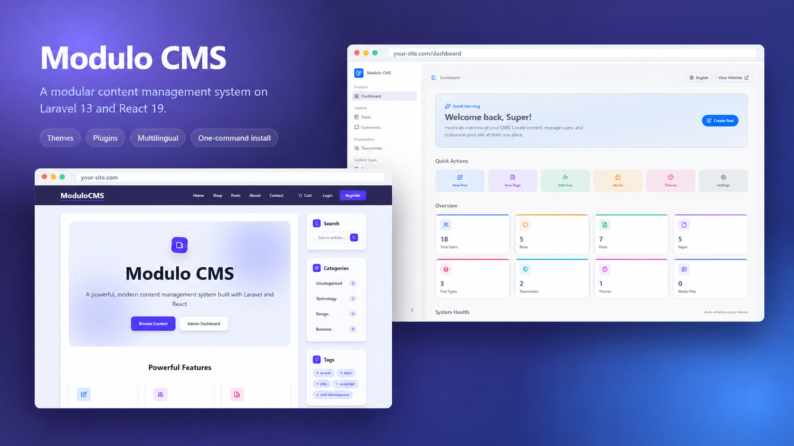
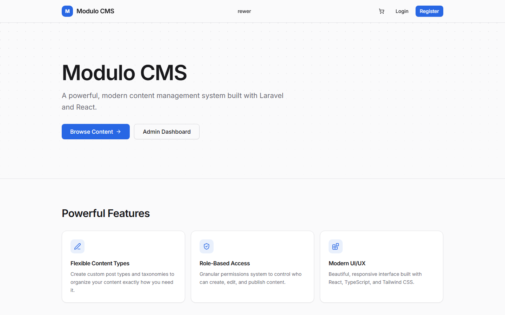
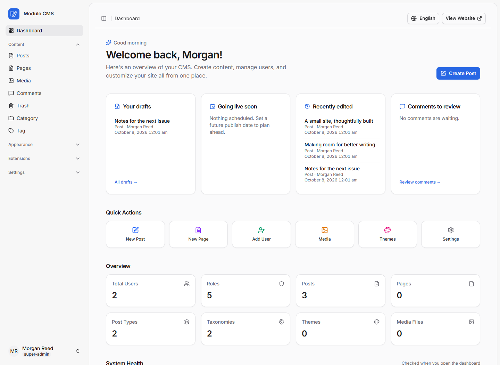
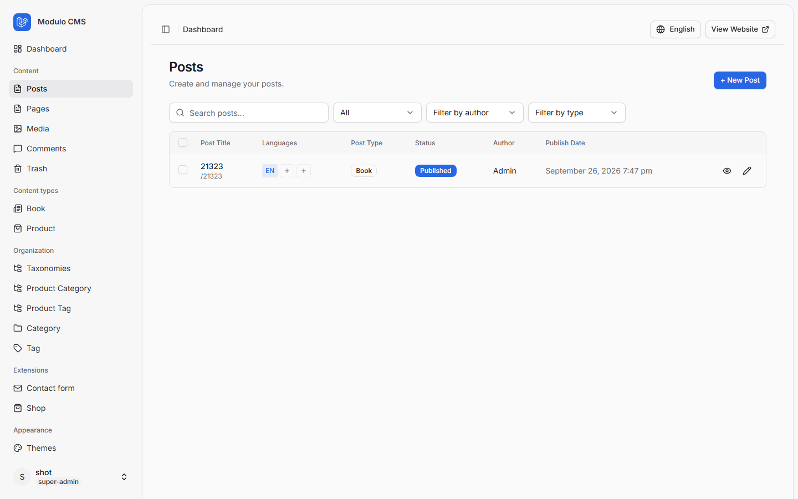
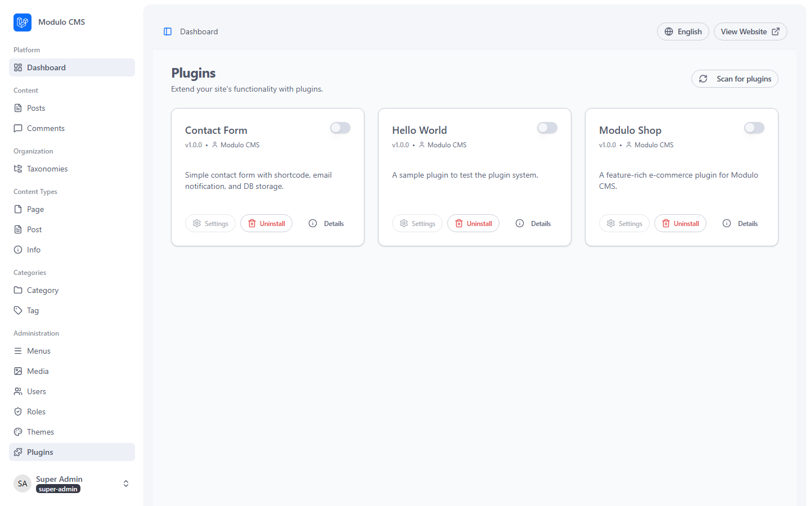
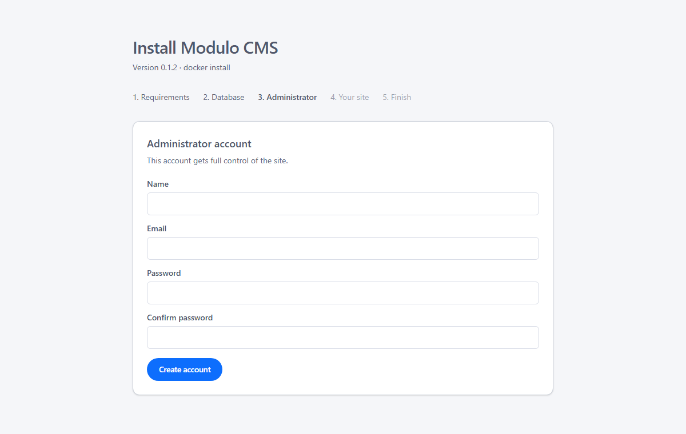

# Modulo CMS

[](https://github.com/PhantomPixelDev/modulo-cms/actions/workflows/tests.yml)
[](LICENSE)



**Modulo is a free, open-source CMS for your own server.** Publish pages and posts, manage translations, and add a shop through plugins. It runs on a VPS or dedicated server using Docker Engine and Docker Compose, with a browser-based administration dashboard.

The production stack includes the application, nginx, PostgreSQL, Redis, a queue worker, and a scheduler. PHP, Composer, Node.js, and database services do not need to be installed separately on the host.

**[Read the documentation](docs/index.md)** — start with [getting started](docs/getting-started.md), the [editor guide](docs/editor-guide.md), or the [shop guide](docs/shop.md).

## What you can do with it

- **Publish content** — pages, blog posts, menus and an image library, with drafts and scheduled publishing.
- **Multiple languages** — translate any post, page or menu item (English and Spanish included in the demo).
- **Users & permissions** — admin, editor and reader roles out of the box; decide exactly who may publish.
- **Online shop** — install the shop plugin for products, cart, checkout and payments (Stripe, PayPal, Mollie).
- **Contact forms** — install the contact-form plugin, drop in a shortcode, get emails.
- **Operations** — scheduled backups, guarded updates, web health checks, and background-service diagnostics.
- **Your design** — switch themes, or keep the clean default.

## Try the demo first

No install needed — open [the live demo](https://dev-modulo.ppxl.dev/), then log in with a public demo account:

| Role                    | Email                | Password    |
| ----------------------- | -------------------- | ----------- |
| Demo admin (editing)    | `admin@example.com`  | `admin123`  |
| Editor (writes content) | `editor@example.com` | `editor123` |
| Reader                  | `user@example.com`   | `user123`   |

The demo restores clean content every four hours, including uploads and recovery drafts. Use your own installation for work you want to keep.

Demo accounts cannot administer backups, extensions, users, API tokens or server
credentials. See [security](docs/security.md) for the server-enforced restrictions.

## Install on a server

Requirements:

- A Linux server with shell access.
- Docker Engine running, with the Docker Compose plugin (`docker compose`). Podman with a working Compose provider is also supported.
- Bash, `curl`, `tar`, and OpenSSL for the installer.
- For a public site, a domain pointing to the server and an HTTPS reverse proxy such as Caddy or nginx.

Run these commands on the server:

```bash
docker info
docker compose version
curl -fsSLO https://raw.githubusercontent.com/PhantomPixelDev/modulo-cms/main/install.sh
less install.sh
APP_URL=https://cms.example.com bash install.sh
```

Replace `https://cms.example.com` with your site's public URL. Configure your reverse proxy to forward to the web container's HTTP port, **8080** by default; use `WEB_PORT=8081` with the installer if that port is occupied.

The installer downloads deployment files for a published release, generates application and database secrets, and starts the stack in a new `modulo-cms/` directory. It creates a `.env` file there; keep it private and retain it for future updates.

Once HTTPS is configured and the containers are running, generate a one-time setup
token with `docker compose exec app php artisan modulo:install-token` from the
deployment directory. Open `https://cms.example.com/install`, paste the token into
the wizard, and create your administrator account. The `localhost` address printed
by the installer refers to the server itself.

Configure production SMTP for email delivery. Mailpit is included in the development stack only. See [installation](docs/installation.md) for manual Docker, Podman, and bare-metal setup, and [configuration](docs/configuration.md) for environment settings.

## Local development

For contributing or testing changes, use the development stack:

```bash
git clone https://github.com/PhantomPixelDev/modulo-cms.git
cd modulo-cms
cp .env.dev.example .env.dev
./modulo.sh up dev
```

Then open <http://localhost:8000> (dashboard at `/dashboard`, test emails at <http://localhost:8025>). On Windows use Git Bash or WSL with a working container runtime. See [Contributing](.github/CONTRIBUTING.md) for development commands and quality checks.

## Screenshots

| Public site                                            | Admin dashboard                                          |
| ------------------------------------------------------ | -------------------------------------------------------- |
|          |  |
| Post editor with translations                          | Plugin management                                        |
|       |            |
| First-run setup wizard                                 |                                                          |
|  |                                                          |

## Keeping it running

- **Updates:** open _Settings → Updates_ for available versions and the upgrade commands for your installation. Core upgrades take a backup first; plugin updates are available from the dashboard on normal installations.
- **Backups:** the scheduler creates nightly database dumps and weekly full backups. _Settings → Backups_ lists full backups for download and restore; see the [backup guide](docs/backup-restore.md).
- **Plugins:** _Extensions → Plugins → Browse registry_ — the [Shop](https://github.com/PhantomPixelDev/modulo-plugin-shop), [Contact Form](https://github.com/PhantomPixelDev/modulo-plugin-contact-form) and more install in one click. Every package is checksum-verified before installing.

## Learn more

[Browse all documentation](docs/index.md), including configuration, APIs, architecture, and release guides.

|                                                        |                                                      |
| ------------------------------------------------------ | ---------------------------------------------------- |
| [Getting started](docs/getting-started.md)             | First login, navigation, and your first page         |
| [Installation](docs/installation.md)                   | Detailed setup options                               |
| [Editor guide](docs/editor-guide.md)                   | Writing posts, pages and translations                |
| [Draft recovery](docs/editing.md)                      | Saving, scheduling, recovery, and previews           |
| [Shop guide](docs/shop.md)                             | Products, checkout, payments, and orders             |
| [Troubleshooting](docs/troubleshooting.md)             | Common errors and service diagnostics                |
| [Upgrading](docs/upgrading.md)                         | Versions, preflight checks, per-channel commands     |
| [Security and runtime upgrades](docs/modernization.md) | Supported versions, plugin builds and Redis rollback |
| [Backups](docs/backup-restore.md)                      | What is saved, and how to test a restore             |
| [Security](docs/security.md)                           | Hardening checklist                                  |
| [Plugins](docs/plugins.md)                             | Installing plugins and writing your own              |
| [Themes](docs/theme-development.md)                    | Changing the design                                  |
| [Theme settings](docs/theme-settings.md)               | Colors, typography and layout in the admin           |
| [React content partials](docs/theme-partials.md)       | Reusable React modules in pages and posts            |
| [Demo fixtures and testing](docs/demo-testing.md)      | Compact examples, safe replacement and link checks   |
| [Contributing](.github/CONTRIBUTING.md)                | Development setup and quality gates                  |
| [Repository layout](docs/repository-layout.md)         | Source folders and tooling configuration             |

Built with PHP 8.5 (8.4 supported) · Laravel 13 · React 19 · Inertia 3 · PostgreSQL 16 · Redis 8. MIT licensed — see [LICENSE](LICENSE).
